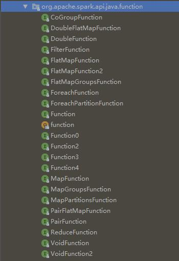
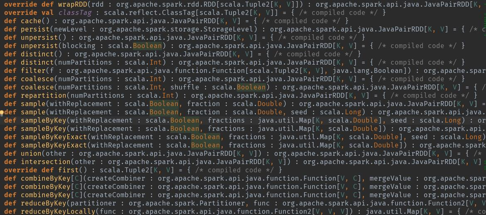

大概有一个世纪没有更新过博客了，吃完晚饭坐在工位上发呆，在百无聊赖的时候突然想到自己可以写篇博客来打发时间，瞬间高兴得像个400斤的孩子。哈哈，开个玩笑。之前由于实习太忙，每天虽然都有很多东西想写，但是实在没有时间，5月初就要离职了，也闲下来了。我会慢慢把实习期间比较有用的东西补上来。

言归正传，昨天下午看RNG和IG半决赛重播的时候，隔壁做CTR预估的前辈忽然凑过来让我帮他找个Bug。大概就是一些数据统计不准确的问题，因为这部分数据我之前也洗过，加上他比较忙，所以就让我帮忙看了。

这个任务的逻辑比较简单，我们广告主网站里会有用户任何行为的记录，我需要从`s3`上的行为日志里统计出不同用户在不同广告主网站里的所有有意义的历史行为用于用户召回。我是用`pySpark`统计的，例行化以后放在`EMR`每天跑，正好他们当时的代码是用`hadoop`写的，于是找完bug之余，顺便小小研究了一下两者的异同，觉得还是有不少收获的。

之前的一篇博客里我可能提到过，`spark`相比`hadoop`提供了更多了处理操作和衍生生态，编程亲和度更高，难度更低，这样说非常笼统，今天正好深入说一下。

#### 语言层面

首先是两个框架在语言层面的比较，`hadoop`出现比较早，由`java`编写，并且官方只提供`java`的API（但是你可以通过种种方式自己写出来其他语言的API）。`spark`作为后起之秀，由当下火热的函数式范式语言`scala`编写，同时官方还提供包括`java`，`python`，`R`语言在内的API。单从语言层面来讲，我觉得`spark`的优势已经比较明显了，因为`scala`这种语言提供处理逻辑本身就与`map/reduce`的思想及其接近，具体的例子我会写在后面。另外通过我实习期间的观察，周围做大数据的前辈写`MR`时也都是首选`scala`。

#### MR操作

`hadoop`里的`MR`实现起来相当鸡肋，因为是由一个纯粹的面向对象语言实现的，用起来也就是那一套套条条框框。在`hadoop`要跑起来一个任务大概需要三个步骤。

首先需要继承一个`Mapper`类并改写它的`map`方法。`Mapper`是个泛型类，它允许携带四个泛型对象，分别表示输入和输出的Key值和Value值，这里我给个我写过的例子：

```java
public class OfflineContentMapper extends Mapper<Object, Text, Text, Text> {
   ......
    protected void map(Object key, Text value, Mapper<Object, Text, Text, Text>.Context context) throws IOException, InterruptedException {
     ......
   }
  ......
}

```

然后需要继承一个`Reducer`类并改写它的`reduce`方法。`Reducer`类也允许携带四个泛型对象，分别表示输入和输出的Key值和Value值，同样给例子：

```java
public class OfflineContentReducer extends Reducer<Text, Text, NullWritable, Text> {
    ......
    protected void reduce(Text key, Iterable<Text> values, Reducer<Text, Text, NullWritable, Text>.Context context) throws IOException, InterruptedException {
      ......
    }
	......
}

```

然后就可以开一个`main`调用了，如下的例子中，首先配置创建一个新的`job`类，然后是将刚才的`Mapper`和`Reducer`都配置进去，另外还要配置输出的key，value类型等等：

```java
public class RunMain {
    public static void main(String[] args) throws IOException, ClassNotFoundException, InterruptedException {
        String output = args[1];
        String jobId = args[2];
        String duration = args[3];
        System.out.println("output:" + output);
        System.out.println("jobId:" + jobId);
        System.out.println("duration:" + duration);
        Configuration conf = new Configuration();
        conf.set("job_id", jobId);
        conf.set("mkPixelIds", getValidPixelId());
        Job job = Job.getInstance(conf);
        addInputPath(job, Integer.valueOf(duration));
        FileOutputFormat.setOutputPath(job, new Path(output));
        job.setJobName("offline contents");
        job.setJarByClass(RunMain.class);   
        job.setMapperClass(OfflineContentMapper.class);
        job.setMapOutputKeyClass(Text.class);
        job.setMapOutputValueClass(Text.class);
        job.setReducerClass(OfflineContentReducer.class);
        job.setOutputFormatClass(TextOutputFormat.class);
        job.setOutputKeyClass(Text.class);
        job.setOutputValueClass(Text.class);
        job.waitForCompletion(true);
    }
}
```

这些都是我删了很多以后贴上去的代码，完整的代码会很多很多。总体上用`hadoop`写一个`MRjob`的思路就是：

>1. 写好map和reduce的处理类。
>2. 写好输入输出的数据类。
>3. 新建job，配置任务信息，用`依赖注入`的方式将以上类全部注入job类中。

怎么样？是不是很typical的java模式？现在我们再来看看以上的任务的`spark`版本，这里以`python`为例：

```python
if __name__ == '__main__':
    start_day = sys.argv[1]
    event_list = ['ViewContent', 'AddToCart', 'Purchase']

    sc = SparkContext(appName="Debug")
    sc.setLogLevel("ERROR")

    pix_id_rdd = sc.textFile('s3://walle-dsp-jar.clientgear.com/Huper/pix_list.txt')
    pix_id_list = pix_id_rdd.collect()

    start_day = datetime.datetime.strptime(start_day, '%Y%m%d') - datetime.timedelta(days=1)
    start_day = start_day.strftime('%Y%m%d')
    level_file_source = get_source_str(30, start_day, 1)
    level_file_dist = get_dist_str(start_day)

    rdd_lines = sc.textFile(level_file_source)
    rdd_lines = rdd_lines.map(divide(event_list)).filter(lambda x: x is not None).distinct().groupByKey().map(lambda x: (x[0], x[1].data))
    rdd_lines.saveAsPickleFile(level_file_dist)
```

简简单单一个脚本就搞定了，在使用`spark`的时候，我们的一切行为都是围绕`RDD`（关于RDD可以参考我之前写的[这篇博客](https://prohuper.github.io/2017/12/25/Spark-Note-02/)）展开的。`spark`提供了大量针对`RDD`的`map/reduce`操作，我们在创建一个`RDD`以后，就可以直接调用其对应的方法了。

但是这个比较有点不准确，我们是用`saprk`的`python`写法和`hadoop`的`java`对比的，那么`spark`的`javaAPI`相较于`hadoop`有没有便捷性的提升呢？我们都知道，`java`中是不存在`高阶函数`这一说的，所以它不能像`python`和`scala`那样将一个处理方法作为`map/reduce`操作的参数。但是我之前也说过`java`的`Interface`是很强大的，用它可以DIY出来很多看似不支持的特性，比如我们可以来看看`spark`中`javaAPI`简单使用：

```java
JavaRDD<String> lines = sc.textFile("hdfs://log.txt").filter(
  new Function<String, Boolean>() {
    public Boolean call(String s) {
      return s.contains("error");
    }
});
long numErrors = lines.count();
```

是不是颇有点函数式编程的范了？看起来就像我们给`filter`这个`map`操作传递了一个函数，然后对`RDD`里的所有元素做映射处理。但是醒醒，你用的是`java`，这个`Function` 只是个接口 ，这里直接使用匿名内部类实现的。为了方便使用者，`spark`源码中一共实现了这么多`funcion`接口来提供各种各样的处理逻辑：



可能有人还是会觉得这样的写法太`java`了，那我们有没有办法让这段代码更`python`一点吗？有请`java8`里的伪`lambda`表达式：

```java
JavaRDD<String> lines = sc.textFile("hdfs://log.txt").filter(s -> s.contains("error"));
long numErrors = lines.count();
```

是不是感觉好多了？这是我认识的`java`吗？以后谁还敢说`java`笨重？额，扯远了。现在是不是感觉`spark`和`hadoop`的`job`编写难度已经高下立判了？

有人说`hadoop`虽然只提供`map`和`reduce`两种处理方式，但是这样允许`programmers`有更多的发挥空间。EXO me？？？说这话前我们先来看下`spark` 的`RDD`中提供哪些操作，可以点开`JavaPairRDD`这个类的源码看一下：

```scala
class JavaPairRDD[K, V](val rdd : org.apache.spark.rdd.RDD[scala.Tuple2[K, V]])(implicit implicit val kClassTag : scala.reflect.ClassTag[K], implicit val vClassTag : scala.reflect.ClassTag[V]) extends org.apache.spark.api.java.AbstractJavaRDDLike[scala.Tuple2[K, V], org.apache.spark.api.java.JavaPairRDD[K, V]] {
  ... ...
}
```

这个泛型类有个`柯里化`的`隐藏参数`列表，并且其中的两个`隐藏参数`都被声明为这个类的成员`隐藏参数`了，写法比较刁钻。`柯里化`和`隐藏参数`都是`scala`里比较有意思的东西，有兴趣的同学回头可以看一下。上面我打省略号的地方就是`RDD`提供的一些`map/reduce`方法，大概有99个左右，密密麻麻的，我这里放几个，你们随便感受一下。



那么问题来了，这些操作及其`combine`会会跨越你的处理逻辑范围吗？反正我是没遇到过，我身边的人也没有遇到过。就算遇到过，我跟你说为什么吧：

>如果这些操作的处理粒度划分等级的话，越细粒度等级的方法需要你自己写的逻辑就比较简单，所以当我们遇到这些操作覆盖不到的情况时可以选择使用粗粒度的方法加上自己比较复杂的逻辑就行了。大不了我退回原始时代，跟`hadoop`一样，只用`map/reduce`两种操作就行了。

这种情况下，你试着用`hadoop`和`spark`写个按照`key`值规约的逻辑？或者按照`key`值`join`的逻辑？看看谁的开发效率高。So，`MRjob`的编写上`saprk`也展现出了得天独厚的优势，`hadoop`再次哭晕。

### 生态

生态方面我就不敢说什么了，`spark`的生态我在[这篇博客](https://prohuper.github.io/2017/12/25/Spark-Note-02/)中讲过，比较吸引人的应该就是`MLlib` ，`sparkStreaming` 和`SparkSQL`了。这三个我都用过，而且感觉真的是神来之笔。

首先`SparkSQL`可以让`RDD`摇身一变变成`Hive`，然后用`SQL`语句去完成数据分析任务。`MLlib`提供分布式环境下的各种机器学习方法，在处理超大规模的数据分类或预测任务时，把你的注意力转移到建模而不是分布式协调上，我甚至不敢想象用`hadoop`去建个简单的分类模型会有多麻烦。还有`sparkStreaming`，这是我毕业设计里用到的东西，在实时处理框架里跟`storm`也算是半壁江山吧，我会在以后总结毕业设计的博客里重点讲解这个。另外，`spark`生态里支持各种数据库，或者文件系统的对接比如`HBase`，`HDFS`，`s3`等等，其运行模式也不局限于`Yarn`的调度。

这么看来感觉`hadoop` 又不行了？想多了！`hadoop`有个`HDFS`真的就够了，如果说`Spark`是尽量地去兼容其他框架，而`HDFS`则是被其他框架尽量地兼容，是不是很有面子？大数据这块的东西`hive`，`kafka`，`flume`，`storm`包括`spark`敢说自己不支持`HDFS` 数据源？反正我是瞥了公司几个日志处理的架构都能看到`HDFS`的影子。

#### 总结

**hadoop**

>`HDFS`使用广泛。
>
>`MRJob`编写难度较高，开发效率低，生态少。
>
>其`HDFS`比其`MRcore`更有用。

**spark**

>`MRJob`编写简单，上手更快，更符合`函数式编程`的思想。
>
>生态庞大，搞起`OLAP`，图计算，实时分析和机器学习不要太方便。
>
>多语言，多数据源，多调度方式，多应用场景，多多益善！！！
>
>**扣题！！！当我们在使用Spark的时候，我们在使用的就是这些东西。**

最后是一点感想，`python`制霸`机器学习` 之际可能有人会问：哪种语言制霸`bigData`？emmm.....（假装在思考）`scala`无误！！！虽然我只是对`scala`有那么一丢丢的了解，并且这次实习完后本弱鸡应该是和`scala`撇清关系了。如果要给这三个语言在`bigData`中的表现打分的话，我觉得应该是：`scala`>`java`>`python`，理由如下：

> scala：当之无愧的大数据之王，无缝衔接`JVM`所有运行时类，超全面的函数式特性，完美契合`map/reduce`的思想，语法糖也有点甜哦。有人说`scala`编译速度太慢，这算是缺点吗？
>
> java：虽然比较笨重，但是我生态比较庞大，也比你python快多了吧，`pyspark`运行起来不还是要用我`JVM`里的类么。 而且讲道理，`java`真的在变得越来越好，`java10`了解下？
>
> python：最大的优点是简洁（三者之最），另外还有一些撇脚的函数式特性也比较好用。


